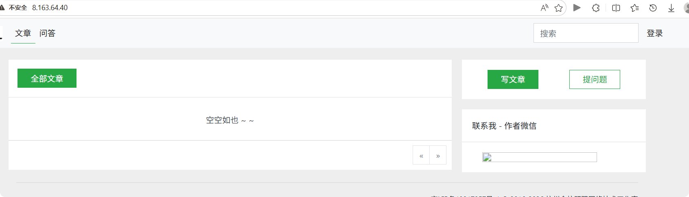
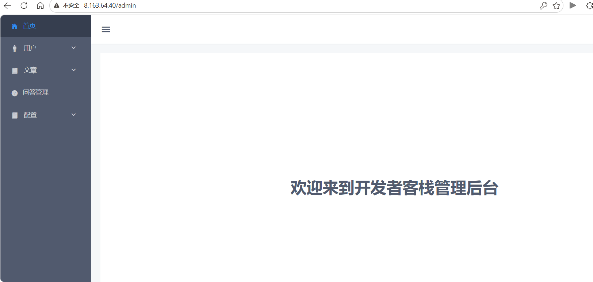
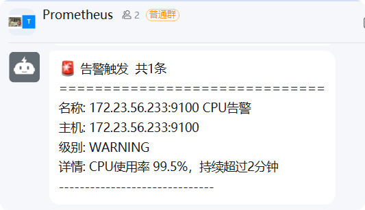
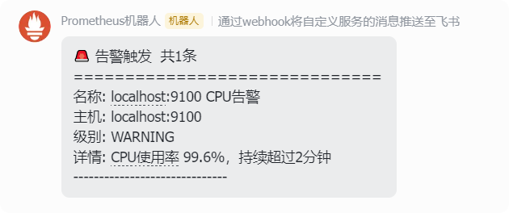
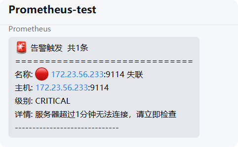
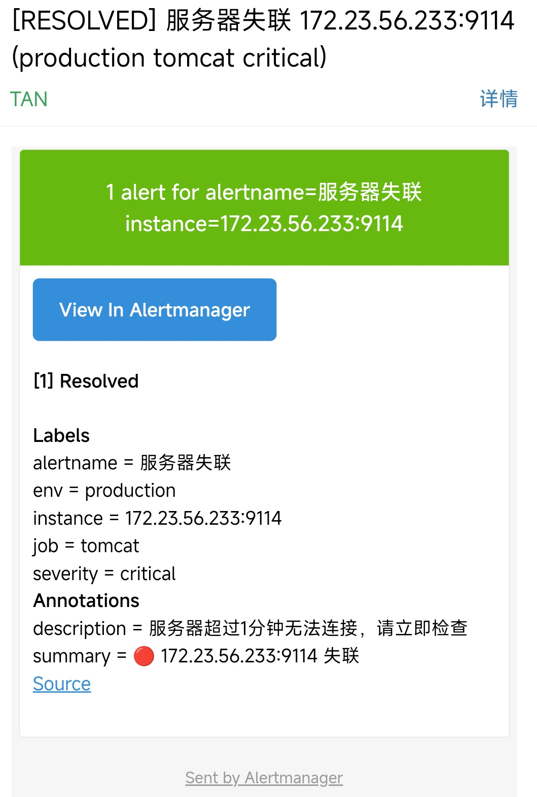
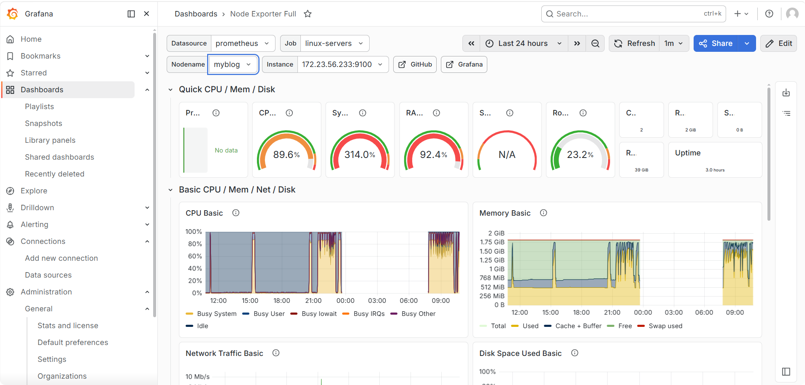
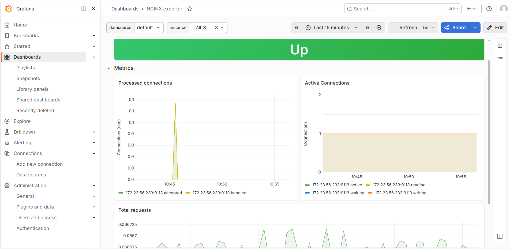
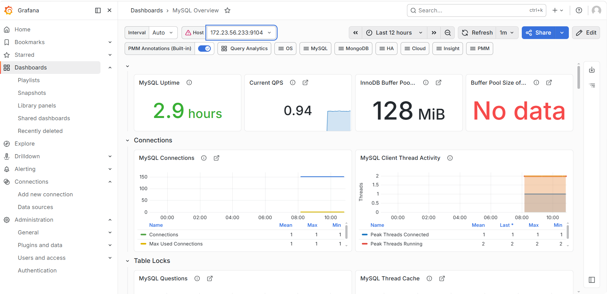
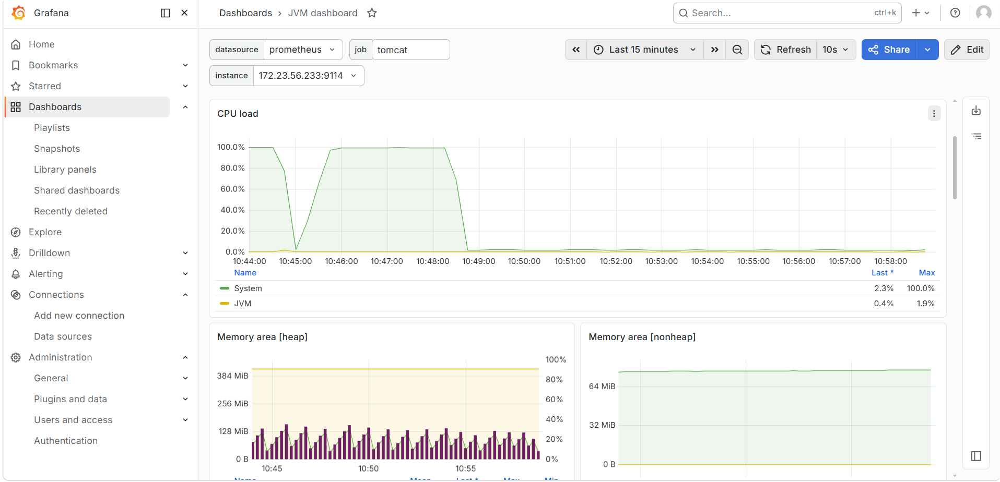

# 博客系统云平台部署与监控运维实战

## 项目简介

本项目模拟企业生产环境，将一套 Java 博客系统完整部署到阿里云 ECS 云服务器上，并构建基本的监控与运维体系。

**项目目标**：掌握云服务器选型、基础服务搭建、反向代理配置、安全组策略、日志分析与监控告警等云运维核心技能。

---
## 项目展示

### 博客首页


### 后台管理页


---
## 技术栈

| 组件 | 技术选型 |
|------|----------|
| 云平台 | 阿里云 ECS（弹性计算服务） |
| 操作系统 | Alibaba Linux |
| Web 服务器 | Apache Tomcat 9.0.97 |
| 反向代理 | Nginx |
| 数据库 | MySQL 8.0 |
| 运行环境 | JDK 1.8.0_241 |
| 监控服务 | Prometheus + Grafana+Alertmanager |

---

## 系统架构

```text
用户浏览器（公网）
|
▼
Nginx (Node1) ← 反向代理 + 负载均衡入口
· 接收 HTTP 请求（80端口）
· 转发至后端 Tomcat
|
▼
Tomcat (Node2) ← Java Web 应用服务器
· 运行博客系统（war包）
· 处理业务逻辑
|
▼
MySQL (Node1) ← 关系型数据库
· 存储用户、文章等数据
· 数据库名：forum-java
```

---

## 🖥 服务器规划

| 节点 | 内网 IP | 部署组件 | 实例规格 |
|------|---------|----------|----------|
| myblog |  | JDK、MySQL、Nginx | 2C2G 40GB |

---

## 本地文件说明

```markdown
blog-cloud-deployment/
├── ROOT.war           # 博客系统应用包
├── sql/               # schema/data.sql初始化脚本                 
├── nginx.conf         # Nginx 反向代理配置
├── packages/          # JDK 安装包,Tomcat 安装包（LFS 管理）
├── prometheus/        # Prometheus 配置文件 
   ├── alert_rules/    # Prometheus 告警规则文件
   ├── prometheus.yml  # Prometheus 主配置文件
├── alertmanager/      #配置告警路由
├── images/                    
├── DEPLOYMENT.md      # 部署文档（详细步骤与命令） 
└── README.md          # 项目说明文档

```

## 📊 监控体系


### 监控架构

```tex
监控架构

Grafana（可视化仪表盘） + Alertmanager（告警管理）
          ↑ 查询指标 & 触发告警
      Prometheus（指标采集与存储）
   /        |        \        \
Node Exp  Nginx Exp  Tomcat JMX  MySQL Exp
   ↑        ↑         ↑          ↑
┌─────────────────────────────────  ┐
│ 被监控节点：myblog ECS            │
│ Nginx : Tomcat : MySQL : 系统资源 │
└─────────────────────────────────  ┘
```

### 多通道告警通知体系

为了实现“故障必达”，避免单一通知渠道的局限性，搭建了 **4 级冗余告警通道**：
#### 告警路由规则
- 🚨 **critical**：钉钉 + 企微 + QQ邮箱（三端同发）
- ⚠️  **warning**：仅钉钉，其余渠道静默
- ℹ️  其他：/alert 接口 → 钉钉+飞书全渠道

### 告警通知截图

| 钉钉告警 | 飞书告警 |
|---------|----------|
|  |  |

| 企业微信告警 | 邮箱告警 |
|-------------|----------|
|  |  |


### 监控指标一览

| 维度 | 监控对象 | 关键指标 | Exporter 端口 |
|------|---------|----------|---------------|
| 系统资源 | CPU/内存/磁盘/网络 | 使用率、负载、IO | 9100 (Node) |
| Web 服务 | Nginx | 连接数、请求量、延时 | 9113 |
| 应用服务 | Tomcat | 线程池、JVM 内存、GC | 9114 |
| 数据库 | MySQL | QPS、慢查询、连接数 | 9104 |

### 告警规则（示例）

| 告警名称 | 触发条件 | 通知方式 |
|----------|----------|----------|
| CPU 使用率过高 | > 80% 持续 2 分钟 | warning |
| MySQL 连接数过载 | 当前连接数 > 80% 上限 | warning |
| 服务宕机 | Exporter 目标 DOWN | critical |
| Tomcat Full GC 频繁 | 1 分钟内超过 3 次 | warning |

### 可视化仪表盘

- Grafana 访问地址：`http://<管理机IP>:3000`
- 已导入仪表盘模板：
  - Node Exporter: ID 1860
  - Nginx: ID 12708
  - Tomcat: ID 3457
  - MySQL: ID 7362

### 📈 Grafana 仪表盘展示
| node | nginx |
|---------|----------|
|  |  |

| mysql | tomcat |
|---------|----------|
|  |  |

### 快速启动监控

```bash
# 被监控节点：确认所有 Exporter 运行中
systemctl status node_exporter nginx-exporter mysqld-exporter
# Tomcat Exporter 通过 javaagent 自动启动，确认端口
curl http://127.0.0.1:9114/metrics | head

# 管理节点：确认 Prometheus 采集正常
curl http://localhost:9090/targets | grep -E "nginx|tomcat|mysql"

# 管理节点：导入 Grafana 仪表盘
# 浏览器打开 http://<管理机IP>:3000 → Import → 输入模板 ID
```

## 快速部署指南
详细的操作命令和步骤，请查看 **[DEPLOYMENT.md](./DEPLOYMENT.md)** 。


## 项目体现的核心能力
- ☁️ **云资源管理**：ECS实例选购、配置变更、安全组精细控制
- ⚙️ **服务自建能力**：独立完成 JDK / MySQL / Tomcat / Nginx 部署与配置
- 🔄 **架构理解**：Nginx 反向代理转发，理解前后端分离思想
- 📊 **监控与排错**：监控告警配置 
- 📄 **文档沉淀**：输出标准化的部署文档，便于协作和交接
